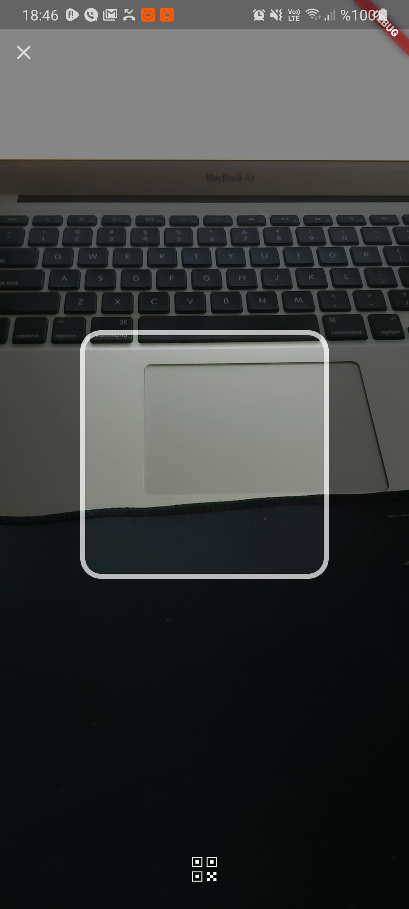
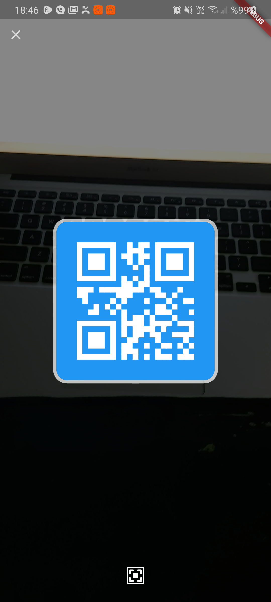

# QR Code Scanner

QR Code scan page like Twitter.

## Example

 


## Installation

To use this plugin, add firebase_messaging as a [dependency in your pubspec.yaml file.](https://flutter.dev/docs/development/packages-and-plugins/using-packages)

```yaml
twitter_qr_scanner: any
```

## Getting Started
Check out the [example](https://github.com/Furkankyl/twitter_qr_scanner/tree/master/example) app using twitter_qr_scanner.

# Android Integration

This plugin work only level greater then sdk version 21.

# iOS Integration
In order to use this plugin, add the following to your Info.plist file:

```plist
<key>io.flutter.embedded_views_preview</key>
<true/>

```


# Flutter
İnit:
``` dart
  GlobalKey qrKey = GlobalKey();
  QRViewController controller;

```

Widget:
``` dart
QRView(
          key: qrKey,
          overlay: QrScannerOverlayShape(
              borderRadius: 16,
              borderColor: Colors.white,
              borderLength: 120,
              borderWidth: 10,
              cutOutSize: 250),
          onQRViewCreated: _onQRViewCreate,
          data: "QR TEXT",// Showing qr code data
        )
```

Scan:
``` dart
  void _onQRViewCreate(QRViewController controller) {
    this.controller = controller;
    controller.scannedDataStream.listen((scanData) {
      setState(() {
        print("QRCode: $scanData");
      });
    });
  }
```
Dispose:
``` dart
   @override
  void dispose() {
    controller?.dispose();
    super.dispose();
  }

```

## License
[Apache](https://github.com/Furkankyl/twitter_qr_scanner/blob/master/LICENSE)